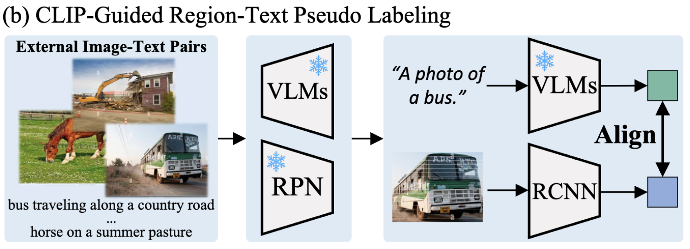
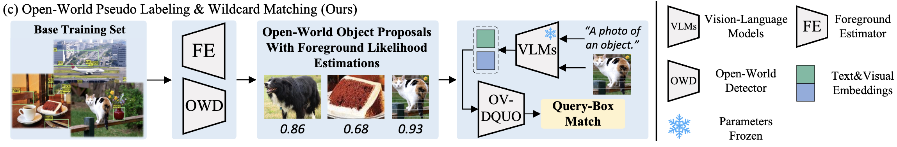
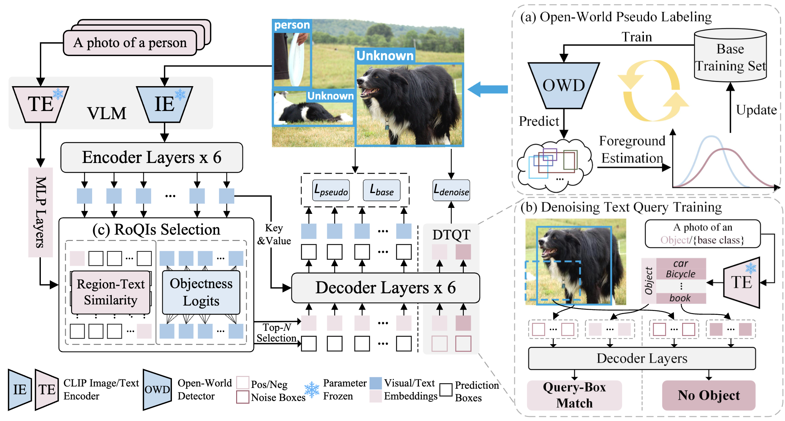

# OV-DQUO: Open-Vocabulary DETR with Denoising Text Query Training and Open-World Unknown Objects Supervision

# Introduction
Open-Vocabulary Detection은 train에서 접하지 않은 새로운 category의 Object를 식별한다. 최근 Vision-Language Models (VLMs)들은 Zero-shot image classification에서 인상적인 성능을 보여주고 있다.
#### VILD
- VLM의 classification knowledge를 Object detector로 knowledge distillation

#### BARON
- 지역의 bag-of-regions embedding을 VLM에 의해 추출된 Image feature와 정렬

#### RegionCLIP
- VLM과 RPN을 사용해 훈련을 위해 image-caption dataset에서 region-text pair를 생성하는 pseudo labeling

위 방법들은 VLM을 간접적으로 활용해 potential을 발휘하지 못한다. 최근 sota 모델들은 VLM의 분류 능력에 의존한다. 하지만 VLM의 region 인식 정확도를 fine-tuning 하거나 self-distillation을 통해 향상시키지만 base category에 대해 더 높은 confidence score에 할당하는 경향이 있어, novel category를 background로 할당할 수도 있다.

- 신뢰도 편향이 novel category detection에 미치는 영향을 검증
    
    VLM과 detector가 base category와 novel category에 부여한 confidence score를 분석
    
    위 그림을 보면 Person이 base category이고, Umbrella는 novel category을 나타낸다. 이때 Detector에는 Person보다 umbrella에 더 낮은 confidence score를 할당한다. 이때 GT box와의 IoU을 기준으로 bounding box의 prediction confidence를 조정해 수동으로 confidence bias를 제거하면 격차가 좁아지는 것을 확인해 볼 수 있다.
    이를 통해 `confidence bias`가 novel category detection에서 성능을 약화시키는 원인임을 확인

기존 pseudo labeling 방식은 VLM으로부터 region-text align을 획득

이와 달리 고정된 VLM이 효과적인 region classification으로 작용해 OVD model의 성능 bottlenexk이 아닌 것을 확인한다.

위 그림과 같이 base와 novel category 간의 confidence bias를 해결하기 위해 `open-world pseudo-labeling`과 `wildcard matching methods`을 도입했다.
이는 detector가 open-world detector에서 인식된 미지의 object와 일반적인 의미를 가진 text embedding을 매칭하도록 학습하여 train시 background로 간주되지 않도록 한다. 이를 위해 `denoising text query training method`을 사용한다.
미지의 object에서 foreground와 background query-box 쌍을 합성해 detector가 contrastive learning을 통해 새로운 object를 background에서 더 잘 구별할 수 있도록 한다.
또한, confidence bias가 region proposal 선택에 미치는 영향을 줄이기 위해 confidence score와 region-text 유사성을 통합한 `Region of Query Interests (RoQIs)을 제안하였다.`

# Methodology

## Preliminaries
### Task Formulation
- $C_{base}$ : 훈련 과정에서 dataset의 부분 class annotation만 사용함. 이를 base classes라 부름
- $C_{novel}$ : 훈련 중 보지 못한 base class와 novel class
- $C_{base} \cap C_{novel} = \varnothing$

### Conditional Matching
DETR은 backbone network, encoder, decoder로 구성
- encoder
    - backbone에서 추출된 feature map을 정제하고 region proposals 생성
- decoder
    - 각 region proposal과 관련된 object query set을 최종 box 및 classification prediction으로 정제

기존 OV-DETR과 CORA는 OVD를 달성하기 위해 conditional matching 방법으로 decoder를 수정
이때, 각 object query $q_i$는 관련된 region proposal을 분류해 label $c_i$를 할당
$$
c_i = \displaystyle\argmax_{c \in C^{base}} cosine(v_i, t_c),
$$
- $v_i$ : frozen VLM의 feature map에서 RoI Align을 수행해 얻은 $b_i$의 region feature
- $t_c$ : class c의 text embedding
- $cosine$ : cosine similarity

이후, class-aware object query인 $q_i^*$는 다음과 같다.
$$
q_i^* = q_i + MLP(t_{c_i})
$$
이때, $q_i$는 일반 object query를 나타내고, decoder는 각 object query를 해당 region proposal $(q_i^*, b_i)$와 함께 반복적으로 정제해 $(\hat{m}_i, \hat{b}_i)$로 만든다. 이때 $\hat{b}_i$는 정제된 box 좌표, $\hat{m}_i$는 sigmoid 확률 스칼라를 나타낸다.
Inference를 수행할 때 frozen VLM은 $\hat{b}_i$를 분류하는 역할을 하고, 각 category에 대한 분류 점수는 해당 일치 확률인 $\hat{m}_i$로 곱한다.
$$
P(\hat{b}_i \in c) = \hat{m}_i cosine(\hat{v}_i, t_c)
$$

## Open-World Pseudo Labeling & Wildcard Matching
