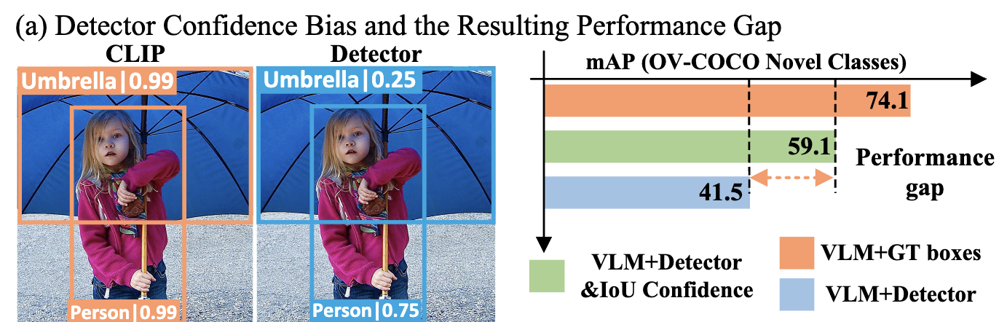

# OV-DQUO: Open-Vocabulary DETR with Denoising Text Query Training and Open-World Unknown Objects Supervision

## Introduction
Open-Vocabulary Detection은 train에서 접하지 않은 새로운 category의 Object를 식별한다. 최근 Vision-Language Models (VLMs)들은 Zero-shot image classification에서 인상적인 성능을 보여주고 있다.
#### VILD
- VLM의 classification knowledge를 Object detector로 knowledge distillation
#### BARON
- 지역의 bag-of-regions embedding을 VLM에 의해 추출된 Image feature와 정렬
#### RegionCLIP
- VLM과 RPN을 사용해 훈련을 위해 image-caption dataset에서 region-text pair를 생성하는 pseudo labeling

위 방법들은 VLM을 간접적으로 활용해 potential을 발휘하지 못한다. 최근 sota 모델들은 VLM의 분류 능력에 의존한다. 하지만 VLM의 region 인식 정확도를 fine-tuning 하거나 self-distillation을 통해 향상시키지만 base category에 대해 더 높은 confidence score에 할당하는 경향이 있어, novel category를 background로 할당할 수도 있다.

1. 신뢰도 편향이 novel category detection에 미치는 영향을 검증
    
    VLM과 detector가 base category와 novel category에 부여한 confidence score를 분석
    